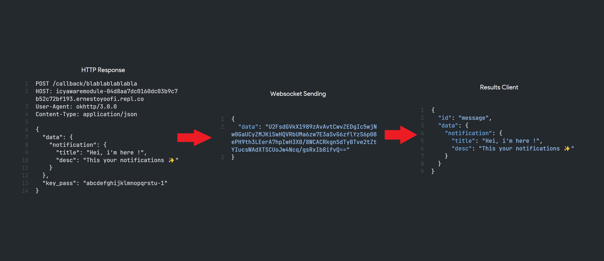

# WebSocket Hook

Implementation to send websocket messages from http requests and sent using crypto-js to receive and open data.

## How it work ?

Applications connected to the websocket will be able to receive appropriate data sent via the webhook on http.

